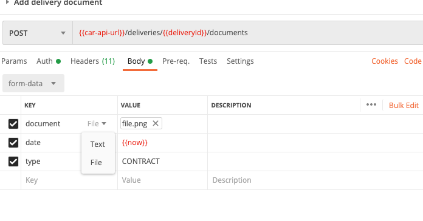

# Upload d'un document de livraison

Le endpoint d'ajout d'un document utilise le format mulipart/form-data qui permet d'envoyer des fichiers en plus de données classiques sous forme de formulaire.

Il y a tout d'abord un élément essentiel, l'envoie du header du **Content-Type** : `multipart/form-data; boundary=<calculated>` le boundary est calculé par le navigateur ou la libraire Http utilisée.

Chaque partie du formulaire est envoyé de cette façon :

- Pour les fichiers 

```json
Content-Disposition: form-data; name="{NOM}"; filename="{NOM DU FICHIER}"[CRLF]
Content-Type: {TYPE MIME}[CRLF]
[CRLF]
{CONTENT}

```
- Pour les données classiques

```json
Content-Disposition: form-data; name="{NOM}"[CRLF]
[CRLF]
{VALEUR}
```

Le [CRLF] correspond à un retour à la ligne "\r\n". Le NOM et le NOM DU FICHIER ne doivent pas contenir de guillemet (") ni de retour à la ligne (\r ou \n).

Les données sont séparées par le boundary.


### Utilisation

**Postman**



**Javascript**

Natif depuis les navigateurs: [form-data](https://developer.mozilla.org/fr/docs/Web/API/FormData/FormData)

**NodeJs**

Avec la librairie: [form-data](https://www.npmjs.com/package/form-data)

** Java (Android) **

Avec [Retrofit](https://futurestud.io/tutorials/retrofit-2-how-to-upload-files-to-server)

** Java (SpringBoot) **

Avec [HttpClient](https://futurestud.io/tutorials/retrofit-2-how-to-upload-files-to-server)

