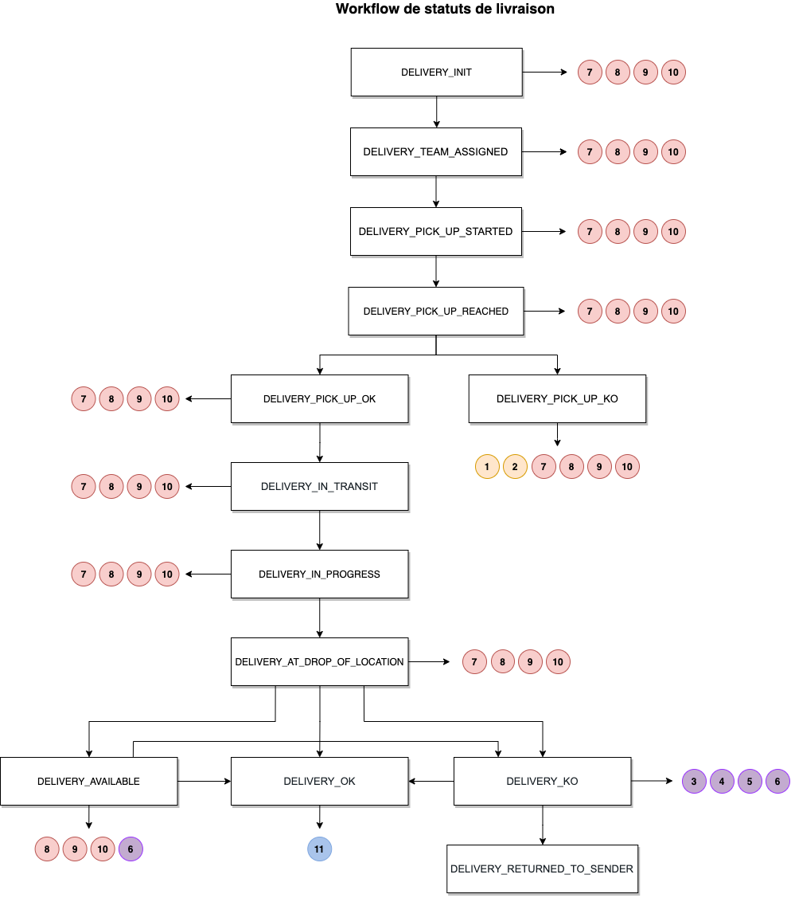
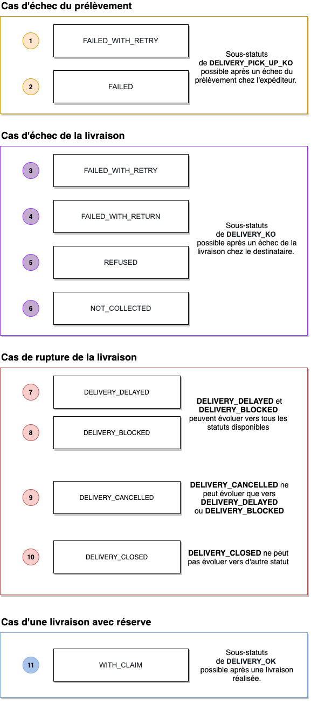

# Statuts de livraison

Au cours de son cycle de vie la commande passe tour à tour par plusieurs statuts. Ceux que nous identifions sont les différents stades de la livraison. 

### Parcours d'une commande

### Liste des statuts de livraison possible

Statut | Sous-statut | Intitulé | Exemples de commentaire
---------|----------|----------|----------|
 `DELIVERY_INIT`|| Demande validée | "N/A"
 `DELIVERY_TEAM_ASSIGNED`|| Demande receptionnée par le coursier | "N/A"
 `DELIVERY_PICK_UP_STARTED`|| Coursier en approche expéditeur | "N/A"
 `DELIVERY_PICK_UP_REACHED`|| Coursier arrivé chez l'expéditeur | "N/A"
 `DELIVERY_PICK_UP_OK`|| Retrait expéditeur réalisé avec succès | "N/A"
 `DELIVERY_PICK_UP_KO`| `FAILED_WITH_RETRY` | Echec du prévèlement avec replanification | “La commande n’était pas prête”   “Aucun vendeur présent/disponible sur site pour récupérer la marchandise”   "Colis manquants (certains transporteurs refusent les enlèvements partiels)"   "Emballage insuffisant (un défaut d'emballage sur un produit fragile peut être un motif de refus)"   "Lieu d'enlèvement inaccessible ou fermé"   "Temps d'attente excessif (contractuellement certains transporteurs peuvent refuser un enlèvement parce qu'ils ont attendu plus de x minutes)"
 `DELIVERY_PICK_UP_KO`| `FAILED` | Echec du prévèlement chez l'expéditeur | “La commande n’était pas prête”   “Aucun vendeur présent/disponible sur site pour récupérer la marchandise”   "Colis manquants (certains transporteurs refusent les enlèvements partiels)"   "Emballage insuffisant (un défaut d'emballage sur un produit fragile peut être un motif de refus)"   "Lieu d'enlèvement inaccessible ou fermé"   "Temps d'attente excessif (contractuellement certains transporteurs peuvent refuser un enlèvement parce qu'ils ont attendu plus de x minutes)"
 `DELIVERY_IN_TRANSIT`|| En transit vers destinataire | "N/A"
 `DELIVERY_IN_PROGRESS`|| En cours de livraison | "N/A"
 `DELIVERY_AT_DROP_OFF_LOCATION`|| Coursier arrivée à destination | "N/A"
 `DELIVERY_OK`|| Livraison réalisée avec succès | "N/A"
 `DELIVERY_OK`| `WITH_CLAIM` | Livraison réalisée avec réserve destinataire | "Le client a acceptée la commande avec les réserves suivante: {commentaire client}"
 `DELIVERY_KO`| `FAILED_WITH_RETRY`| Echec de la livraison avec replanification | "N/A"
 `DELIVERY_KO`| `FAILED_WITH_RETURN`| Echec de la livraison avec retour expéditeur | “Le client était absent"   “Erreur dans l’adresse de livraison”   "Problème d'accessibilité"   "Le Produit ne correspond pas à ce que le client a commandé"   "Le Produit est endommagé"   "Le client refuse la livraison (il peut avoir changé d'avis, certains ne vont pas chercher leur produit en point relais..)"
 `DELIVERY_KO`| `REFUSED`| Livraison refusée par le destinataire | “Le client a refusé"
 `DELIVERY_KO`| `NOT_COLLECTED`| Non retiré par le destinataire | "N/A"
 `DELIVERY_RETURNED_TO_SENDER`|| Retour à l'expéditeur | “Le client était absent"   “Erreur dans l’adresse de livraison”   "Problème d'accessibilité"   “produit 1 ref XXXX  ne correspond pas à ce que le client a commandé”   “Produit 2 ref XXXX produit endommagé”   “Produit 3 ref XXXX produit manquant”
 `DELIVERY_CANCELLED` || Livraison annulée | "Nos équipes ne sont plus en capacité d'effectuer cette livraison {raison}"   raison : "véhicule en panne”   “aucun livreur disponible”   “aucun véhicule disponible” 
 `DELIVERY_BLOCKED` || Livraison bloquée | “Contrôle Douanier”  "Camion bloqué par une intempérie"  “Camion bloqué par la circulation”
 `DELIVERY_DELAYED` || Livraison retardée | “Contrôle Douanier”  "Camion bloqué par une intempérie"  “Camion bloqué par la circulation”
 `DELIVERY_AVAILABLE` || Dsponible en point-relais | "N/A"

### Sous-statuts et cas d'usage 

### Replanification

La replanification de livraison sur une nouvelle date choisie par le client ou par le transporteur se fait via la méthode dédiée : 